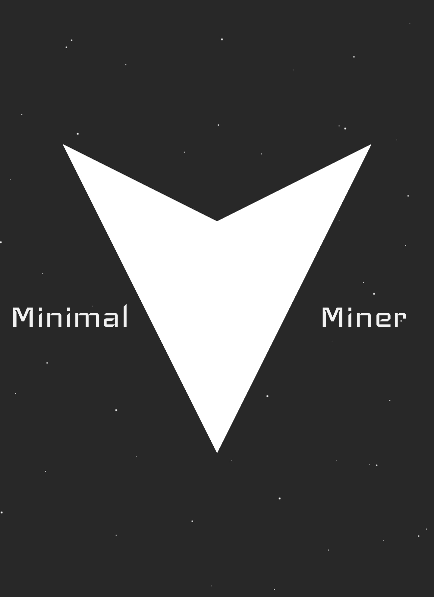

# MinimalMiner

  

## About
MinimalMiner is a 2D shoot-em-up based off of the Atari classic Asteroids featuring minimalist vector graphics. MinimalMiner is currently in early alpha.
 
## Background
This project is based off of an academic project that was to create a sort of asteroids clone using self-coded collision algorithms. The project was enjoyable, and there were a lot of ideas that were had both during and after working on the project that were beyond the scope of was was essentially a 2-3 day (2-3 hours per day) project. This project is more intended to be a sort of space mining game, with the threat of other entities such as space pirates as well as the progression of upgrade mechanics and such. The game is of a highly minimal theme by default but will have the potential to expand beyond this with theme mods (regular modding support using mod.io TBA).

Disclaimer: This is not the same project as the one this was based off of. Much of the code structure has changed (some of it due to seeing what could be improved from the previous project if time was permitting, some of it to tailor to this project itself). Collisions will be based off of engine-collisions as well since they are more optimized. This project is instead more experimental with events and with theme modding than with collisions.

### Story
TBA

### Platforms
PC (Windows, Mac (TBA), Linux (TBA)), Mobile TBA

## Repository Overview

| File/Directory | Contents |
| :------------- | :------- |
| [Assets/Code](Assets/Code) | Source code |
| [Docs](Docs) | Project-related assets (e.g. documentation) |
| [Wiki](https://github.com/xLightling/MinimalMiner/wiki) | API Documentation |
| [Wiki/Roadmap](https://github.com/xLightling/MinimalMiner/wiki/Roadmap) | Project roadmap |

## License
All of the assets created for this project that do not come from third-party sources (only original assets are pushed to GitHub, with the exception of (Assets/Packages); fonts contained under there have licenses associated with them) are licensed under [GPLv3](LICENSE.md) (originally under MIT). 
